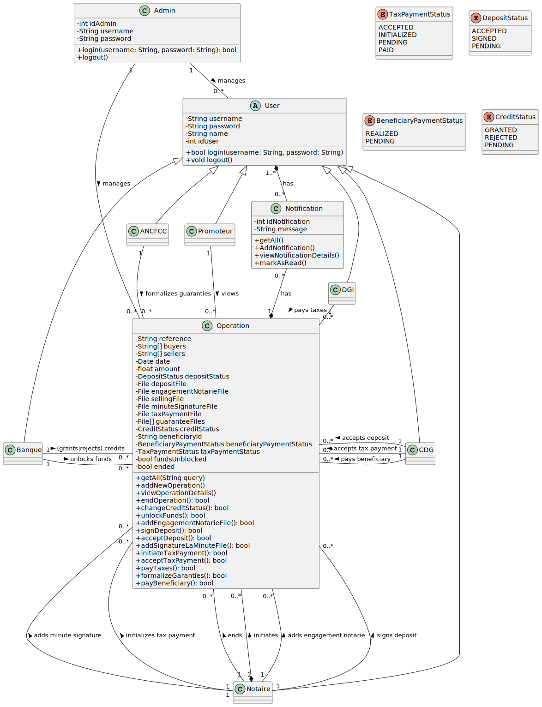

# Notary Conception

### Description

Pour mieux comprendre l'architecture et le flux du système du notaire, nous utilisons UML pour visualiser la séquence de
chaque transaction ou opération qui passe par le système ainsi que les acteurs qui affectent chaque phase du cycle de
vie de la transaction.

#### Diagramme de séquence:

Pour visualiser le cycle de vie de chaque transaction passant par Notary, le diagramme de séquence nous donne une bonne
compréhension des étapes de création et de finalisation d'une transaction.

````mermaid
sequenceDiagram
Actor Notaire
participant Notary
Actor Bank as Banque operator
Actor CDG as CDG operator
Actor DGI as DGI operator
Actor ANCFCC as ANCFCC operator


Notaire ->> Notary : Créer la transaction
activate Notary
Notary ->> Notaire : demandez les détails de l'opération et le "compromis de vente"
Notaire -->> Notary : les détails de l'opération et le "compromis de vente" saisi

Notary ->> Bank : demander l'approbation de l'opération
alt l'opération est prét
Bank -->> Notary : prét
Notary ->> Notaire : demander le document "engagement notarié"
else
Bank -->> Notary : rejeté
Notary ->> Notaire : arrêt de l'opération
end

Notaire -->> Notary : document "engagement notarié" saisi
Notary ->> Bank : demander le déblocage des fonds
alt Les fonds sont débloqués
Bank -->> Notary : fonds débloqués
Notary ->> Notaire : demande de signature de dépôt
else
Bank -->> Notary : les fonds ne sont pas encore débloqués
Notary ->> Notaire : arrêt de l'opération
end
Notaire -->> Notary : signature du dépôt saisie
Notary ->> CDG : demander l'acceptation de la signature et le recu du dépôt
alt le dépôt est accepté
CDG -->> Notary : le dépôt est accepté et recu de dépôt est saisi
Notary ->> Notaire : demander le document "signature à la minute"
else
CDG -->> Notary : rejeté
Notary ->> Notaire : arrêt de l'opération
end
Notaire -->> Notary : document "signature à la minute" saisi
Notary ->> DGI : demander le certificat de paiement des impôts
DGI -->> Notary :le certificat de paiement des impôts saisi
Notary ->> ANCFCC : demander la formalisation de la garantie
ANCFCC -->> Notary : la formalisation de la garantie saisi
Notary ->> CDG : demander le paiemente du bénéficiaire
CDG -->> Notary : bénéficiaire payé
Notaire -->> Notary : apurer de l'opération
Notary -->> Notaire : l'opération apuré
deactivate Notary
````

#### Diagramme d'état:

Le diagramme d'état nous permet de visualiser l'état de la transaction lors du passage par chaque phase et les actions
effectuées par les participants sur l'application.

````mermaid
stateDiagram-v2

state "Initiée" as created
state "En attente" as waiting_approval
state "Crédit accordé" as approved
state "Crédit rejeté" as rejected
state "En attente du déblocage des fonds" as waiting_for_funds_to_be_unlocked
state "Fonds débloqué" as funds_unlocked
state "Opération apurée" as ended
state "Engagement notarié ajouté" as engagement_notarie_added
state "Signature à la minute ajoutée" as signature_la_minute_added
state "Dépôt signé" as deposit_signed
state "Dépôt accepté" as deposit_accepted
state "Paiement des impôts initié" as tax_payment_initiated
state "Paiement des impôts accepté" as tax_payment_accepted
state "Impôts payés" as tax_paid
state "Garanties formalisées" as garanties_formalized
state "Bénéficiaire payé" as beneficiary_paid


[*] --> created : Initiate
created --> waiting_approval
waiting_approval --> approved : Crédit accordé
waiting_approval --> rejected : Crédit rejeté
approved --> engagement_notarie_added : Saisir l'engagement notarié
engagement_notarie_added --> waiting_for_funds_to_be_unlocked
waiting_for_funds_to_be_unlocked --> funds_unlocked : Fonds débloqué
funds_unlocked --> deposit_signed : Dépôt de signature
deposit_signed --> deposit_accepted : Accepter le dépôt
deposit_accepted --> signature_la_minute_added : Saisir la signature à la minute
signature_la_minute_added --> tax_payment_initiated : Initier le paiement des impôts
tax_payment_initiated --> tax_payment_accepted : Accepter le paiement des impôts
tax_payment_accepted --> tax_paid : Payer les impôts
tax_paid --> garanties_formalized : Formaliser les garanties
garanties_formalized --> beneficiary_paid : Payer les bénéficiaires
beneficiary_paid --> ended : Apurer l'opération

waiting_for_funds_to_be_unlocked --> ended: Apurer l'opération
rejected --> ended : Apurer l'opération
ended --> [*]
````

#### Diagramme de class:
Le diagramme de class nous aide à visualiser les entités du système et les relations entre chaque entité.




